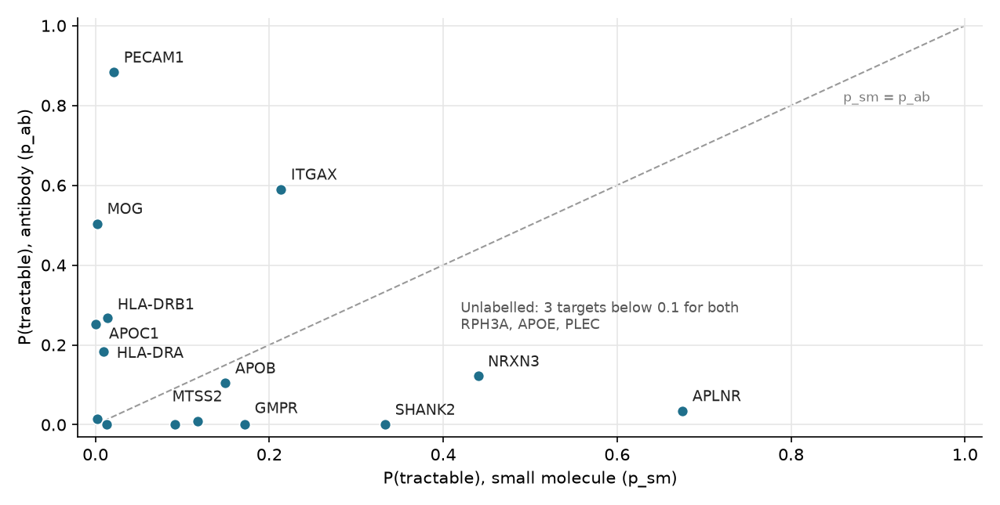

**Overview:** I took my top 15 Alzheimer's disease (AD) targets from Module 2 and asked whether
each one looks like a protein that has already been drugged, and by which modality. I trained a
small-molecule prior and an antibody prior on ESM C 300M embeddings from the course data pack,
validated them with a family-held-out split, listed each target's nearest drugged proteins, scored
the anchor variants (ESM-2 650M) and re-ranked the list for Week 4. The training panel has 1,201
proteins, 401 (one third) with clinical precedence, in 821 family groups. One of my targets,
HLA-DRB1, is in the panel and was removed before fitting (leakage guard), leaving 1,200 training
proteins.

## 1. Re-ranking

**Did the prior agree with my Module 2 ranking?** Mostly not, and that is expected. The two scores
measure different things (disease association versus resemblance to drugged proteins), and the
Spearman correlation between my Module 2 score and the best-modality prior is only **0.21**. The
small positive value comes from the antibody side (0.38 with p_ab, −0.16 with p_sm): my strongest
Module 2 hits are immune and cell-surface proteins. The targets fall into three groups:

- **Looks druggable:** PECAM1 (p_ab 0.88), APLNR (p_sm 0.68), ITGAX (p_ab 0.59), MOG (p_ab 0.50)
- **In between (0.1 to 0.5):** NRXN3 (p_sm 0.44), SHANK2 (p_sm 0.33), HLA-DRB1 (p_ab 0.27), APOC1
  (p_ab 0.25), HLA-DRA (p_ab 0.18), GMPR (p_sm 0.17), APOB (p_sm 0.15), MTSS2 (p_sm 0.12)
- **No precedent for either modality (below 0.1):** RPH3A, APOE, PLEC

| Final | Gene | Module 2 | Change | p_sm | p_ab | Nearest drugged proteins (cosine) |
|---:|---|---:|---:|---:|---:|---|
| 1 | PECAM1 | 4 | +3 | 0.02 | 0.88 | CD2 (0.96), IL12B (0.96), LAMA4 (0.95) |
| 2 | HLA-DRB1 | 2 | 0 | 0.01 | 0.27 | SIGLEC8 (0.87), IFNA10 (0.86), PTGDS (0.85) |
| 3 | HLA-DRA | 1 | −2 | 0.01 | 0.18 | SEMA4D (0.92), GRIK3 (0.92), CA12 (0.91) |
| 4 | ITGAX | 6 | +2 | 0.21 | 0.59 | ITGA2B (0.98), CSF1R (0.96), SEMA4D (0.95) |
| 5 | APOC1 | 3 | −2 | 0.00 | 0.25 | IFNA5 (0.86), SCTR (0.85), SLC34A2 (0.85) |
| 6 | APLNR | 10 | **+4** | 0.68 | 0.03 | AGTR2 (0.96), GHSR (0.95), S1PR2 (0.94) |
| 7 | NRXN3 | 9 | +2 | 0.44 | 0.12 | SDC4 (0.94), KCNB1 (0.93), RELA (0.92) |
| 8 | MTSS2 | 5 | −3 | 0.12 | 0.01 | PDE4D (0.94), KCNQ4 (0.93), PDE4C (0.93) |
| 9 | GMPR | 7 | −2 | 0.17 | 0.00 | EEF2 (0.95), PSMA5 (0.93), RPL11 (0.93) |
| 10 | SHANK2 | 12 | +2 | 0.33 | 0.00 | E2F7 (0.97), MAP3K13 (0.96), KCNQ3 (0.95) |
| 11 | MOG | 14 | +3 | 0.00 | 0.50 | PDCD1LG2 (0.93), TIGIT (0.92), IFNGR2 (0.91) |
| 12 | RPH3A | 8 | **−4** | 0.09 | 0.00 | CACNB3 (0.93), PDE4D (0.93), CACNB2 (0.92) |
| 13 | APOE | 11 | −2 | 0.00 | 0.01 | MADCAM1 (0.86), TNFSF14 (0.85), IL11RA (0.84) |
| 14 | APOB | 13 | −1 | 0.15 | 0.10 | AFP (0.97), LAMA4 (0.95), IFNAR2 (0.95) |
| 15 | PLEC | 15 | 0 | 0.01 | 0.00 | LAMB2 (0.89), EPHA10 (0.87), EPHA1 (0.86) |

APOE and APOB tie on the final score (0.253); the tie is broken by Module 2 order.

**Which target moved most, and why?** Two targets moved four places. **RPH3A** fell furthest, from
8th to 12th. Rabphilin-3A is a cytosolic synaptic-vesicle protein built from a Rab-binding zinc
finger and two C2 domains, which work through protein and membrane contacts rather than a
ligand pocket. It is intracellular, so antibodies cannot reach it (p_ab 0.00), and its small-molecule
prior is low (0.09). Its nearest drugged proteins, the calcium-channel β subunits CACNB3 and
CACNB2, are most likely labelled through the drugged channel complex they belong to, not because
they hold a pocket themselves. **APLNR** rose furthest, from 10th to 6th. It is the apelin receptor, a class A GPCR, and
its nearest drugged proteins (AGTR2, GHSR, S1PR2) are all class A GPCRs, the classic
small-molecule target class. PECAM1 and MOG also rose (+3 each) on strong antibody priors.

**Justifying w = 0.6:** I weighted Module 2 evidence slightly above tractability:

1. **Disease relevance comes first:** a druggable protein that is not causal in AD is a wasted
   programme, and tractability can be engineered (new modality, pathway partner) while causality cannot
2. **The prior is only moderately reliable:** its family-split AUROC is 0.745 (Section 3), so it
   should adjust the ranking, not override it
3. **Sensitivity:** at w = 0.5 the prior starts to override strong genetics (HLA-DRA, the Module 2
   #1, falls to 4th behind ITGAX). At w = 0.7 the top six are exactly my Module 2 top six, so
   tractability only reshuffles within them and APLNR, my best small-molecule target, drops to 7th

w = 0.6 keeps the disease signal in charge while still moving clearly tractable targets up.

## 2. Modality

{width=82%}

**Target: PECAM1 (p_ab 0.88, p_sm 0.02)**, the sharpest antibody-over-small-molecule split.

- **Localisation:** a single-pass type I membrane protein on endothelial cells, platelets and
  leukocytes, with a large extracellular region exposed to the blood
- **Family:** six immunoglobulin-like domains. Its nearest drugged proteins are a cell-surface Ig
  receptor (CD2), a secreted cytokine subunit (IL12B) and a basement-membrane laminin (LAMA4), all
  extracellular, and CD2 and IL12B are antibody-drugged
- **Likely pocket:** none deep, since Ig domains bind partners (PECAM1 binds itself between cells)
  through flat, broad protein–protein surfaces that small molecules cannot grip
- **AD angle:** PECAM1 marks blood–brain barrier endothelium, so an antibody can reach it from the
  blood without crossing the barrier

**The mirror image, APLNR (p_sm 0.68, p_ab 0.03):** a seven-transmembrane class A GPCR. Its
ligand-binding (orthosteric) pocket sits inside the transmembrane helix bundle, which is where most
GPCR small-molecule drugs bind, and its nearest drugged proteins are three other class A GPCRs. The
part an antibody could reach, the short N-terminus and extracellular loops, is small. The panel has
53 class A GPCRs, 33 of them with clinical precedence, so this prior rests on a well-populated class.

**The hard case, APOE (p_sm 0.00, p_ab 0.01):** a secreted lipid carrier with no enzyme
pocket or receptor fold, so it looks like neither drug class. That is a modality problem, not a
reason to drop it. Options include structure correctors that block the ApoE4 domain interaction,
antibodies against ApoE deposited in plaques, or the pathway around it (LDLR, ABCA1).

\needspace{12\baselineskip}

## 3. Validation

| Split | AUROC | Average precision |
|---|---:|---:|
| Random (StratifiedKFold) | 0.839 | 0.717 |
| **Family (GroupKFold on family_group)** | **0.745** | **0.548** |
| Chance | 0.500 | 0.333 |

**Why the family split is the honest number:** in a random split, close relatives sit on both
sides of a fold. If AKT1 is in training, AKT3 is easy to "predict". That rewards memorising
families, not learning what makes a protein tractable. In this panel the family split is strict:
all 61 protein-kinase-superfamily members form one group, and all 53 class A GPCRs another, so each
class is held out as a whole. That matches the real situation for a new AD target whose family
may never have been drugged (APOC1, MTSS2, RPH3A).

**What the random split would have hidden:** a drop of 0.094 AUROC and 0.169 AP. The AP gain over
chance shrinks from 0.384 to 0.215, so the random split hides about 44% of it. The prior still
clearly beats chance, but a team reading 0.84 would trust it more than it deserves, especially for
proteins unlike anything in the panel.

## 4. Variants

I use **UniProt numbering**, which includes APOE's 18-residue signal peptide (R176C is mature R158C,
ε2, and C130R is mature C112R, ε4). Scores are ESM-2 650M masked marginals, log P(mutant) − log
P(wild type). The percentile ranks each variant among every possible substitution in that protein,
so a low percentile means more surprising than most.

| Gene | Variant (UniProt) | Meaning | Score | Percentile in protein |
|---|---|---|---:|---:|
| APOE | R176C (rs7412) | ε2, protective for AD | −8.56 | 11.8 |
| APOE | C130R (rs429358) | ε4, strongest common AD risk allele | **+7.21** | **100.0** |
| TREM2 | R47H (rs75932628) | rare AD risk, impairs ligand binding | −5.16 | 47.7 |
| TP53 | R175H | cancer hotspot (structural) | −5.97 | 19.3 |

For comparison, the median substitution scores −3.9 in APOE, −4.8 in TREM2 and −2.2 in TP53.

**Interpreting the scores:**

- **APOE ε4 (C130R), the most "expected" change in all of APOE:** the model prefers arginine over
  the human reference cysteine here, because ε4 is the ancestral allele and other mammals carry
  arginine at this position, yet it is the largest common genetic risk factor for AD
- **APOE ε2 (R176C), scored as damaging:** R176 sits in the receptor-binding region and ε2 does
  weaken LDL-receptor binding (ε2/ε2 causes type III hyperlipoproteinaemia), so the model flags a
  real functional change that is protective for AD
- **TREM2 R47H, middling:** no more surprising than a typical TREM2 substitution despite a two- to
  fourfold rise in AD risk, because its effect is a subtle loss of ligand binding on the Ig-domain
  surface rather than a broken fold
- **p53 R175H, in the damaging tail:** expected for a structural hotspot, but not the most extreme
  hotspot (R248Q scores −9.55, 5.2nd percentile), since cancer selects for dominant-negative and
  gain-of-function effects, not for evolutionary surprise

The two APOE alleles show the key point: the model ranks them in the **opposite order** to their
AD risk.

**Why a strongly negative score is not "pathogenic":** the score measures how unusual a change is
given patterns learned from millions of natural sequences. That is evolutionary surprise, not
disease. A change can be surprising and harmless, or ordinary and disease-causing (like ε4).

**What these models cannot see:**

- **Variant types:** non-coding, splice, insertion and deletion, and copy-number variants
- **Context:** binding partners (lipid, receptor, DNA), cell type, expression level, dose (one or
  two copies), age, and interactions with other variants
- **Clinical evidence:** population frequency, segregation and case data used by ClinVar and ACMG
  rules, which Week 5 compares against CADD, REVEL and SpliceAI

## 5. Limitations and next step

**What sequence alone cannot tell me:**

- **Pockets and 3D shape:** the prior says "looks like drugged proteins", not "has a ligandable
  pocket", and cryptic or mutant-specific pockets (p53 Y220C) are invisible
- **History in the labels:** labels record where industry has worked, so undrugged classes
  (apolipoproteins, scaffolds such as SHANK2 and PLEC) score low partly because nobody has tried.
  Labels can also pass to every subunit of a drugged complex, which is likely why two of GMPR's
  nearest "drugged" proteins are a proteasome subunit and a ribosomal protein (PSMA5, RPL11)
- **An unbalanced antibody prior:** only 66 training proteins have antibody precedence, against 301
  for small molecules, so p_ab rests on far fewer examples than p_sm
- **Brain delivery:** nothing here models the blood–brain barrier, which decides whether a drug
  reaches a microglial target such as ITGAX or HLA-DR
- **Direction and safety:** whether to inhibit or activate, and on- and off-target toxicity (HLA-DR
  is central to immune function)
- **Similarity is not homology:** a typical panel pair already has cosine 0.72 (5th to 95th
  percentile 0.30 to 0.90), so a top-3 match at 0.85 to 0.98 is a ranking, and some matches
  (SHANK2 → E2F7, APOB → AFP, both 0.97) likely reflect protein size and composition rather than
  shared biology

**Two targets for Week 4 (structure-based pocket assessment):**

1. **ITGAX (final rank 4, p_ab 0.59):** CD11c marks disease-associated microglia, so it is close to
   AD biology. Integrin α subunits like ITGAX carry an inserted I-domain with a metal-ion site
   (MIDAS) that binds ligands. In the related ITGAL this domain is drugged by lifitegrast, which
   competes with ICAM-1 binding, and it also has an allosteric pocket that experimental inhibitors
   bind. Week 4 should test whether ITGAX's I-domain shows comparable pockets, which would open a
   small-molecule route alongside antibodies
2. **APLNR (final rank 6, p_sm 0.68):** my strongest small-molecule prior, a GPCR with a defined
   orthosteric pocket, and experimental apelin-receptor structures exist, so Week 4 can check the
   predicted structure against them before assessing the pocket

I did not pick PECAM1, despite its first place: it is an antibody target with flat binding
surfaces, so pocket assessment would add little. I would hold APOE as an exploratory third
structure, because the ε4 domain interaction is a known structure-corrector site that a sequence
prior cannot see.

## Unmapped genes

**Unmapped targets in my top 15:** none. All 15 have a reviewed UniProt protein, so all were
scored. In my full Module 2 list of 1,115 genes the only gene without a protein is **UBBP4**, a
ubiquitin pseudogene. A protein language model cannot score it. It would need different evidence:

- **Expression evidence:** RNA-seq showing whether the pseudogene is transcribed in AD brain
- **Regulatory evidence:** whether it acts as a non-coding RNA (for example a decoy for UBB
  microRNAs), tested by knockdown
- **Genetic evidence:** eQTL or GWAS colocalisation linking its locus to AD risk
